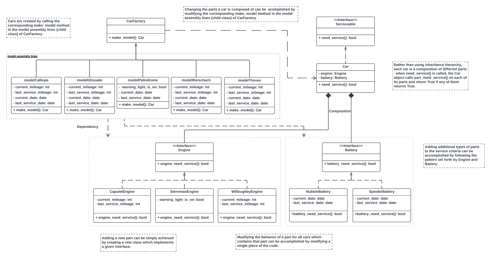

# Lyft Backend Engineering Virtual Experience
This repo contains the codebase of the tasks included in the virtual experience program of Forage.

## Task 1: Design a clean architecture for an existing, unfinished component in Lyft Rentals user case.
Drafted a [UML class diagram](https://www.visual-paradigm.com/guide/uml-unified-modeling-language/uml-class-diagram-tutorial/) that represents a new reorganized architecture.

## Task 2: Refactor a messy codebase
- Implemented the new architecture using [Factory Pattern](https://refactoring.guru/design-patterns/factory-method) to allow easy extensibility going forward.
- [Refactored](https://refactoring.guru/refactoring) the codebase.

## Task 3: Develop comprehensive unit tests for the newly refactored system
Written unit tests to guarantee each functionality works as expected.

## Task 4: Add new functionality to your system using Test-Driven Development
Integrated Test-Driven Development workflow to add new functionality to the refactored system.
