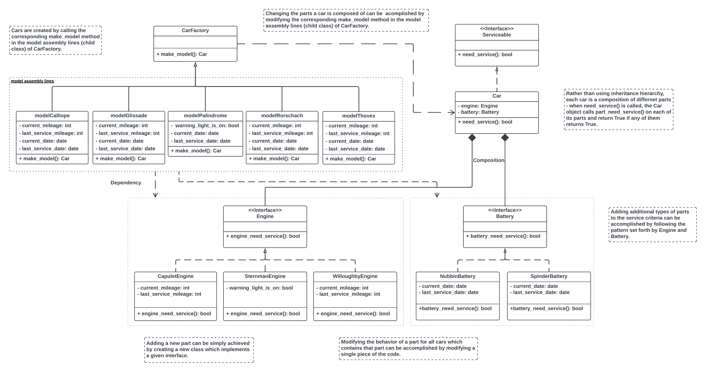
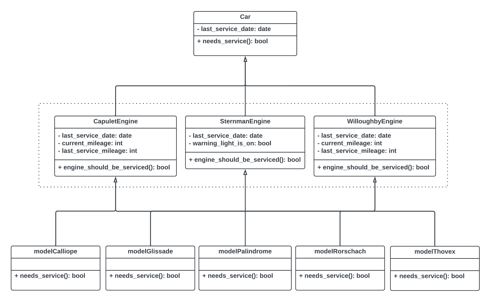

# Lyft Backend Engineering Virtual Experience
This repo contains the codebase of the tasks included in the virtual experience program of Forage.

## Task 1: Design a clean architecture for an existing, unfinished component in Lyft Rentals user case.
Drafted a [UML class diagram](https://www.visual-paradigm.com/guide/uml-unified-modeling-language/uml-class-diagram-tutorial/) that represents a new reorganized architecture.

- UML diagram of my new architecture:

- UML diagram of previous architecture from original codebase:

## Task 2: Refactor a messy codebase
- Implemented the new architecture using [Factory Pattern](https://refactoring.guru/design-patterns/factory-method) to allow easy extensibility going forward.
- [Refactored](https://refactoring.guru/refactoring) the codebase.

## Task 3: Develop comprehensive unit tests for the newly refactored system
Written [unit tests](test/test.py) to guarantee each functionality works as expected.

- The tests have been organized to match the source files.
- They have each been implemented using the unit test framework.
- Each test case checks a single component to see if it works as expected.

## Task 4: Add New Functionality to Your System Using Test-Driven Development to Enhance the Extensibility of the New System
Integrated Test-Driven Development workflow to add new functionality to the refactored system.

### Experiment 1 
Upgraded parts to test the new system's ease of use for future team members when adding new service criteria and changing parts for each car model (e.g., changing the type of battery installed in a car model).

### Experiment 2
New parts, such as tires, were added to demonstrate the extensibility of the new system. This shows that the components are extensible and simple to modify. The new system is modularized, meaning that complex changes to multiple classes are unnecessary when adding new functionalities. This allows for the rapid and efficient addition of new service criteria.

### Conclusion: 
In the refactored codebase, the factory pattern was adopted to design the new architecture. By decoupling the classes and implementing this architecture, the steps required to make changes to criteria and parts are much simpler and is less prone to errors. The new system ensures that extending the system or implementing changes takes substantially less time.
